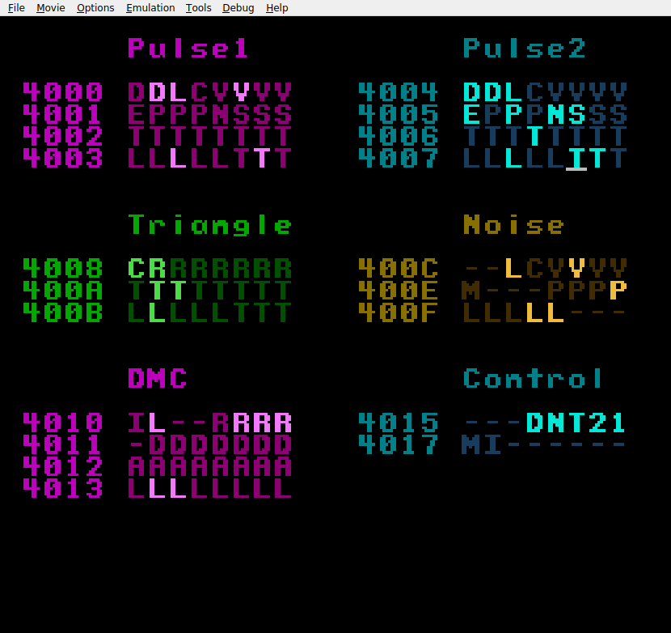
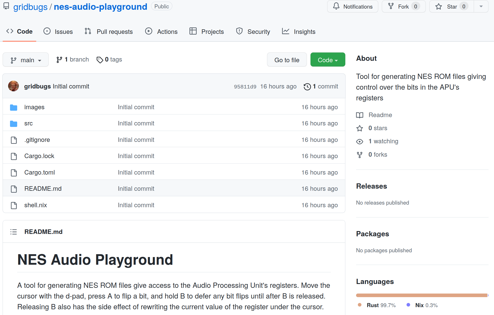
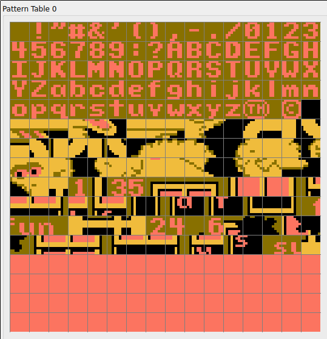
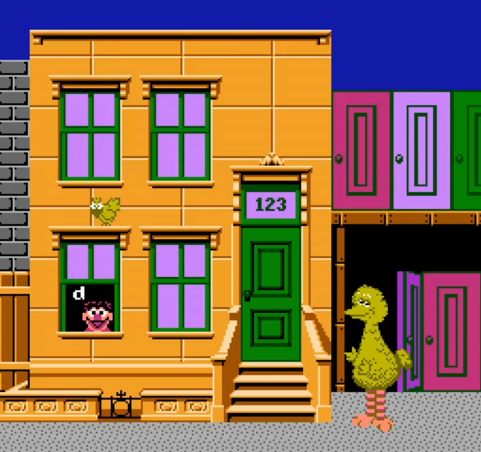
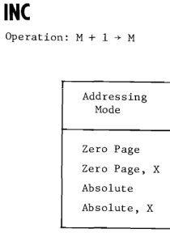

# **NES Programming in Rust**

## Sydney Rust Meetup 2023-03-01

#### Stephen Sherratt (@gridbugs)

gridbugs.org
github.com/gridbugs
hachyderm.io/@gridbugs
twitch.tv/gridbugs

---

# Demo (video) 🤞🤞🤞



[https://youtu.be/QHoISiWdPXo](https://youtu.be/QHoISiWdPXo)

---



---
# Usage
```bash
cargo run -- -o playground.nes  # generate ROM file
fcoux playground.nes            # run ROM in NES emulator
```
---
# Usage

```rust
use std::io::Write;
use ines::{Ines, Header};

let ines = Ines {
    header: Header { ... },
    chr_rom: chr_rom(), // tiles and sprites
    prg_rom: prg_rom(), // code and static data
};

let mut data = Vec::new();
ines.encode(&mut data);

let mut file = std::fs::File::create(output_path).unwrap();
file.write_all(&data).expect("Failed to write ROM file");
```

---

# Character ROM



```rust
...
// 24: A
0b00111100,
0b01100110,
0b01100110,
0b01111110,
0b01100110,
0b01100110,
0b01100110,
...
```
---
# Program ROM: Block

```rust
use mos6502_assembler::Block;

fn prg_rom() -> Vec<u8> {
    // A Block is an intermediate representation that keeps track of labels
    // and a cursor so you can put code/data at specific addresses.
    let mut b = Block::new();

    ...
}
```
---

# ROM info from fceux NES emulator



```
Loading Sesame Street - Big Bird's Hide & Speak (USA).nes...

 PRG ROM: 16 x 16KiB = 256 KiB
 CHR ROM: 16 x  8KiB = 128 KiB
 ROM CRC32: 0xfde1c7ed
 ROM MD5:  0xe11377293fff45358d99aee90f98cbd6
 Mapper #: 1
 Mapper name: MMC1
 Mirroring: Horizontal
 Battery-backed: No
 Trained: No
```

---
# Program ROM: Block

```rust
use mos6502_assembler::Block;

fn prg_rom() -> Vec<u8> {
    // A Block is an intermediate representation that keeps track of labels
    // and a cursor so you can put code/data at specific addresses.
    let mut b = Block::new();

    ...
}
```

---
# Program ROM: Code/Data in EDSL

```rust
use mos6502_assembler::Block;

fn prg_rom() -> Vec<u8> {
    // A Block is an intermediate representation that keeps track of labels
    // and a cursor so you can put code/data at specific addresses.
    let mut b = Block::new();

    // describe program with EDSL
    b.inst(...);
    b.label(...);
    b.literal_byte(...);
    // ...etc

    ...
}
```

---
# Program ROM: Assemble

```rust
use mos6502_assembler::Block;

fn prg_rom() -> Vec<u8> {
    // A Block is an intermediate representation that keeps track of labels
    // and a cursor so you can put code/data at specific addresses.
    let mut b = Block::new();

    // describe program with EDSL
    b.inst(...);
    b.label(...);
    b.literal_byte(...);
    // ...etc

    // convert from intermediate representation to byte array
    // (this pass is needed to resolve labels)
    let mut prg_rom = Vec::new();
    b.assemble(/* start address */ 0x8000, /* ROM bank size */ 0x4000, &mut prg_rom)
        .expect("Failed to assemble");
    prg_rom
}
```


---
# 6502 Assembler Rust EDSL

Defining and calling a function with string labels:

```rust
b.label("set_cursor_to_tile_coord"); // define a function with a label
b.inst(Txa, ());               // x component passed in X register
b.inst(Asl(Accumulator), ());  // multiply by 8 (width of tile)
b.inst(Asl(Accumulator), ());
b.inst(Asl(Accumulator), ());
b.inst(Sta(Absolute), Addr(var::cursor::X));
b.inst(Tya, ());               // y component passed in Y register
...
b.inst(Rts, ());               // Return from subroutine
...
// call a function
b.inst(Ldx(ZeroPage), var::bit_table_entry::TILE_X);
b.inst(Ldy(ZeroPage), var::bit_table_entry::TILE_Y);
b.inst(Jsr(Absolute), "set_cursor_to_tile_coord");
```
---
# 6502 Assembler Rust EDSL

Static data:

```rust
b.label("blink_colour_table");
const BLINK_COLOURS: [u8; 8] = [
    0x20,
    0x20,
    0x10,
    0x10,
    0x00,
    0x00,
    0x10,
    0x10,
];
for c in BLINK_COLOURS {
    b.literal_byte(c);
}
...
b.inst(Tax, ()); // transfer the blink index into X register
b.inst(Ldy(AbsoluteXIndexed), "blink_colour_table"); // read current blink colour
b.write_ppu_address(0x3F11); // write the blink colour to the palette
b.inst(Sty(Absolute), Addr(0x2007));
```

---
# 6502 Assembler Rust EDSL

Platform-specific extension:

```rust
trait BlockNes {
    fn init_ppu(&mut self);
    fn write_ppu_address(&mut self, addr: u16);
    fn write_ppu_value(&mut self, value: u8);
    fn set_ppu_nametable_coord(&mut self, col: u8, row: u8);
    fn set_ppu_palette_universal_background(&mut self, value: u8);
    ...
}

impl BlockNes for Block { ... }

fn program(b: &mut Block) {
    b.inst(...);
    ...
}
```

---
# 6502 Assembler Rust EDSL

Rust is a macro language!

```rust
// Read 8 consecutive bytes from a little-endian address stored
// at var::bit_table_address::LO into a buffer beginning at
// var::bit_table_entry::START.
b.inst(Ldx(Immediate), 0);
for i in 0..8 {
    b.inst(Lda(XIndexedIndirect), var::bit_table_address::LO);
    b.inst(Sta(ZeroPage), var::bit_table_entry::START + i);
    b.inst(Inc(ZeroPage), var::bit_table_address::LO);
}
```
---
# 6502 Assembler Rust EDSL



Addressing mode errors are type errors:

```rust
b.inst(Inc(AbsoluteYIndexed), 0x0000);
```

```
error[E0277]: the trait bound
`AbsoluteYIndexed: instruction::inc::AddressingMode`
is not satisfied
```

---
# 6502 Assembler Rust EDSL


How addressing mode errors are caught at compile time:
```rust
pub mod inc {
    pub trait AddressingMode: ReadData + WriteData { ... }

    impl AddressingMode for Absolute { ... }
    impl AddressingMode for AbsoluteXIndexed { ... }
    impl AddressingMode for ZeroPage { ... }
    impl AddressingMode for ZeroPageXIndexed { ... }

    pub struct Inst<A: AddressingMode>(pub A);

    pub fn interpret<A: AddressingMode, M: Memory>(
        _: A, cpu: &mut Cpu, 
        memory: &mut M,
    ) -> u8 {
        let data = A::read_data(cpu, memory).wrapping_add(1);
        A::write_data(cpu, memory, data);
        cpu.status.set_negative_from_value(data);
        cpu.status.set_zero_from_value(data);
        cpu.pc = cpu.pc.wrapping_add(A::instruction_bytes());
        A::num_cycles()
    }
}
pub use inc::Inst as Inc;
```

---

# More NES Shenanigans at [gridbugs.org/tags/#nes](https://www.gridbugs.org/tags/#nes)


- Reverse-Engineering NES Tetris to add Hard Drop
- Conway's Game of Life on the NES in Rust
- Zelda Screen Transitions are Undefined Behaviour
- NES Emulator Debugging
